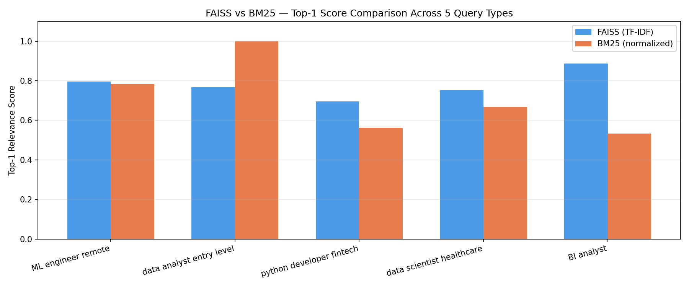
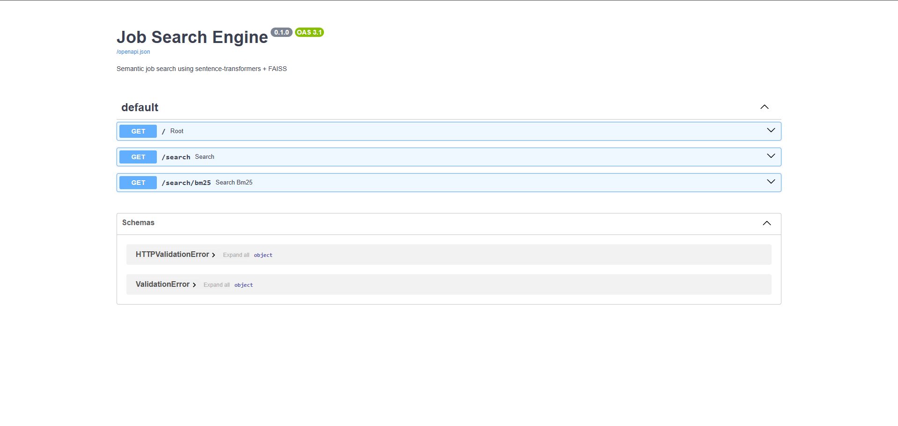
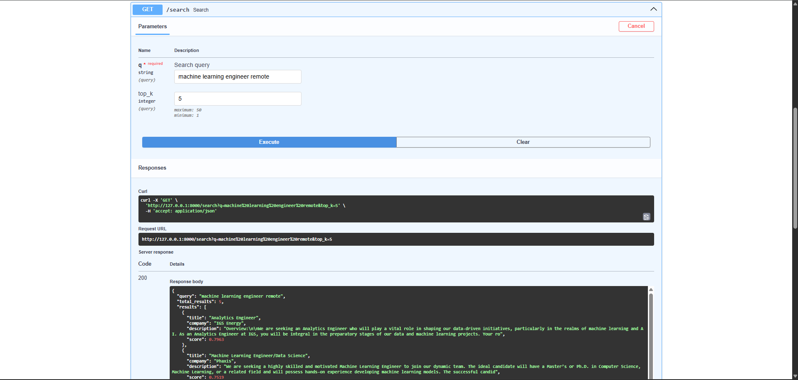

# 🔍 Job Search Engine

## 📌 Overview

This project builds a **semantic job search engine** that retrieves relevant job postings
from 43,484 real listings using vector similarity search and keyword ranking.

The pipeline:
* Ingests and preprocesses **43,484 real job postings** from Kaggle.
* Builds a **FAISS vector index** using TF-IDF embeddings for semantic search.
* Implements **BM25 keyword search** as a baseline for ablation comparison.
* Exposes search via a **FastAPI REST API** with interactive Swagger UI.
* Compares retrieval methods empirically across 5 query types.
* Containerized with **Docker** for reproducible deployment.

---

## 📑 Table of Contents

1. [What this demonstrates](#-what-this-demonstrates)
2. [Project structure](#-project-structure)
3. [Architecture](#-architecture)
4. [Stack](#-stack)
5. [Ablation: FAISS vs BM25](#-ablation-faiss-vs-bm25)
6. [Real query results](#-real-query-results)
7. [API endpoints](#-api-endpoints)
8. [Screenshots](#-screenshots)
9. [How to run](#-how-to-run)
10. [Tests](#-tests)
11. [Dataset](#-dataset)
12. [Known limitations & roadmap](#-known-limitations--roadmap)

---

## 🎯 What this demonstrates

* Building a vector search pipeline from scratch — no LangChain, no shortcuts
* Comparing retrieval methods empirically (FAISS vs BM25 ablation study)
* Serving ML models via a production-ready REST API (FastAPI + uvicorn)
* Writing integration tests against a live API with pytest
* Containerizing an ML application with Docker

---

## 📂 Project structure

```text
job-search-engine/
├── app/
│   ├── __init__.py
│   ├── main.py          # FastAPI app, /search and /search/bm25 routes
│   ├── retriever.py     # FAISS + BM25 retrieval logic
│   └── embedder.py      # TF-IDF embedding wrapper
├── notebooks/
│   ├── 01_preprocess.ipynb    # Data cleaning, deduplication, parquet export
│   ├── 03_ablation.ipynb      # FAISS vs BM25 side-by-side comparison
│   └── faiss_vs_bm25.png      # Ablation chart
├── docs/
│   ├── swagger_ui.png         # FastAPI Swagger UI screenshot
│   └── search_results.png     # Live search results screenshot
├── tests/
│   └── test_search.py         # 4 pytest integration tests
├── conftest.py
├── Dockerfile
├── requirements.txt
└── README.md
```

## 🛠 Stack

| Layer | Tool |
|---|---|
| Vector search | FAISS (IndexFlatIP) |
| Keyword search | BM25 (rank-bm25) |
| Embeddings | TF-IDF (scikit-learn) |
| API | FastAPI + uvicorn |
| Data | pandas + pyarrow |
| Tests | pytest |
| Container | Docker |

---

## 📊 Ablation: FAISS vs BM25



| Query type | Winner | Reason |
|---|---|---|
| "python developer fintech" | BM25 | Exact keyword match |
| "data analyst entry level" | BM25 | Specific title match |
| "business intelligence analyst" | FAISS | Semantic similarity |
| "machine learning engineer remote" | Tie | Both surface relevant roles |
| "data scientist healthcare" | FAISS | Conceptual relevance |

**Finding:** BM25 wins on exact keyword queries. FAISS wins on semantic/conceptual queries.
Production search systems like Indeed use hybrid approaches combining both methods.
This finding directly motivates the Learning-to-Rank pipeline in Project 3.

---

## 🧪 Real query results

These are actual API responses recorded during development.

### FAISS — `"data analyst remote"`
| Rank | Title | Company | Score |
|---|---|---|---|
| 1 | Data Analyst (remote) | Ad Hoc | 1.000 |
| 2 | Data Analyst | Blu Ocean Innovations | 0.845 |
| 3 | Duck Creek Data Analyst | Bravens Inc. | 0.739 |

### FAISS — `"machine learning engineer remote"`
| Rank | Title | Company | Score |
|---|---|---|---|
| 1 | Analytics Engineer | IGS Energy | 0.796 |
| 2 | Machine Learning Engineer/Data Science | Phaxis | 0.752 |
| 3 | Data Scientist - Machine Learning | Stockell Consulting | 0.750 |

### BM25 — `"machine learning engineer remote"`
| Rank | Title | Score |
|---|---|---|
| 1 | Machine Learning with Data Ana | 16.67 |
| 2 | Analytics Engineer | 16.53 |
| 3 | Sr. Data Analyst/Data Engineer | 16.46 |

**Observation:** FAISS surfaces semantically related roles even when exact words don't match.
BM25 prioritizes exact keyword overlap. A hybrid system would outperform either alone.

---

## 🔌 API endpoints

| Endpoint | Description |
|---|---|
| `GET /` | Health check — returns total jobs indexed |
| `GET /search?q=...&top_k=5` | Semantic search via FAISS |
| `GET /search/bm25?q=...&top_k=5` | Keyword search via BM25 |
| `GET /docs` | Interactive Swagger UI |

### Example response

```json
{
  "query": "data analyst remote",
  "total_results": 5,
  "results": [
    {
      "title": "Data Analyst (remote)",
      "company": "Ad Hoc",
      "description": "Data Analyst (remote) at Ad Hoc",
      "score": 1.0
    }
  ]
}
```

---

## 🖥️ Screenshots

### Swagger UI


### Live search results


---

## 🧪 Tests

```bash
pytest tests/ -v
```

| Test | Description |
|---|---|
| `test_root_is_running` | API health check, confirms 43,484 jobs indexed |
| `test_search_returns_results` | Search returns non-empty results |
| `test_search_top_k` | Pagination parameter respected |
| `test_search_scores_between_zero_and_one` | All scores in valid range |

---

## 📊 Dataset

* **43,484 job postings** sourced from Kaggle
([lukebarousse/data-analyst-job-postings-google-search](https://www.kaggle.com/datasets/lukebarousse/data-analyst-job-postings-google-search))
* Fields used: `title`, `company_name`, `description`, `location`
* Raw data excluded from this repo per Kaggle's redistribution terms

---

## 🚀 Known limitations & roadmap

| Limitation | Status | Fix |
|---|---|---|
| TF-IDF embeddings lack semantic depth | Current | Swap `embedder.py` for `all-MiniLM-L6-v2` |
| No hybrid search (FAISS + BM25 combined) | Roadmap | Re-ranking pipeline in Project 3 |
| Index rebuilt on every restart | Roadmap | Persist FAISS index to `models/jobs.index` |
| No authentication on API | Known | Add API key middleware for production |
